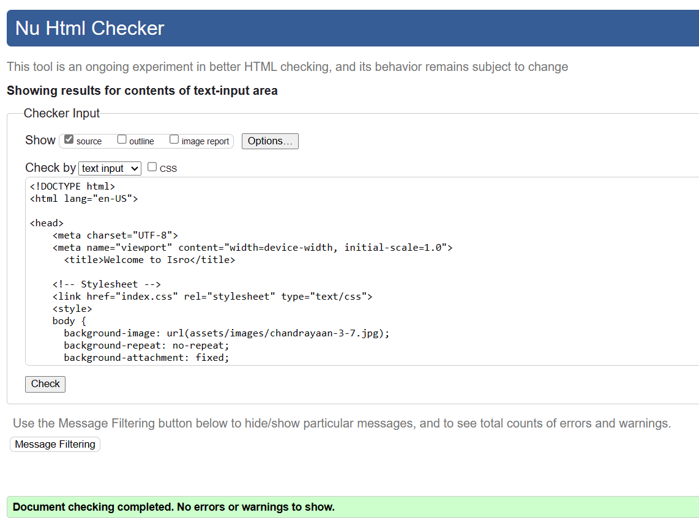
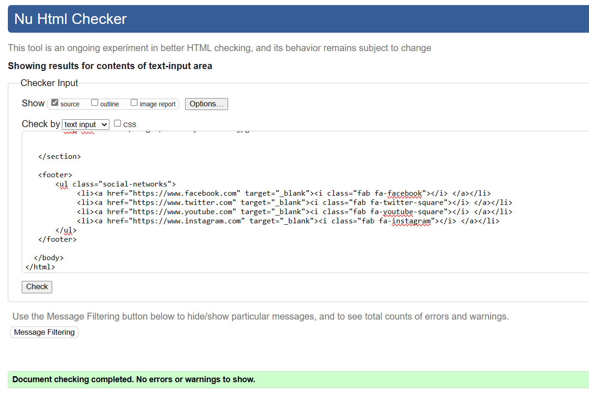
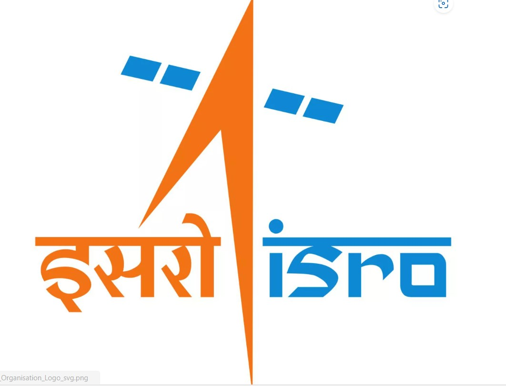

 chandrayaan-3 is my first project.
The Chandrayaan-3 website is where its mention about there Moon landing journey.  India made history with its Chandrayaan-3 mission when it became the first country to successfully land a spacecraft near the lunar south pole.

First Time Visitor Goals:
As a First Time Visitor, I want to easily understand the main purpose of the site.
As a First Time Visitor, I want to be able to easily navigate through the website, so I can find the content.
User Stories :
As a First Time Visitor, I want to easily understand the main purpose of the site, so I can learn more about the Chamdrayaan-3 project.
As a First Time Visitor, I want to quickly acces the website so I can start Using.
As a first-time visitor, I want to understand the purpose of the Website, so I can use it properly.
As a first-time visitor, I want to see what technologies have been used to create the Website, so I can learn more about them and use them myself.
As a user of the Website, I want to see what filters are currently applied on each chart, so I can analyze visualized data correctly.
As a user of the Website, I want to be able to reset applied filters for each chart, so I can switch filters I'm not currently interested in.
As a mobile device user, I want the Website to be mobile-friendly, so I can use it on my tablet or smartphone to visit it.
####
Validator Testing :
####
HTML Testing :

####
SIGNUP Testing :

####
GALLERY Testing :

####
CSS Testing :

####
Lighthouse Testing :

####
* Technologies used :
* HTML
* CSS
* Google fonts
* Font awesome
* User stories
####
Testing :
* I tested the Website in different browsers: Chrome, Firefox, Edge.
* I confirmed that gallery and signup working correctly.
* I confirmed that the header and the footer are displayed correctly
* I confirmed that all external links are working and opening in a new tab
* I confirmed that the Website is responsive and displayed correctly on all standard screen sizes
* Image on diffrent devices.
* 
####
* Features :
* Logo Bar
* Logo

####
On Website there is a Favicon Image.
####
Homepage :
* On Homepage image displayed.
* On Homepage information Provided.
* On Homepage Logo Shows.
* On Homepage address and there othere information showed.
* On Homepage shows all Gallery, Signup page.
* On Homepage shows all social network.
####
Gallery :
* On Gallery its showing all images regarding Chandrayaan-3.
####
SignUp :
On Signup page its displayed image and on the top its a signup page.
Note : Images are dark because its on Moon fourteen days there is a light and fourteen days dark. When Rover land on Moon it was dark .
####
Deployment :
* The site was deployed to GitHub pages. The steps to deploy are as follows:
* In the GitHub repository, navigate to the Settings tab and then choose pages in the left panel.
* From the source section drop-down menu, select the Main Branch, then click "Save".
* The page will be automatically refreshed with a detailed ribbon display to indicate the successful deployment.
* The live link can be found here
####
Local Deployment :
In order to make a local copy of this project, you can clone it. In your IDE Terminal, type the following command to clone my repository:

git clone : https://github.com/Seemavij/chandrayaan3.git

Alternatively, if you use Gitpod, you can click here, which will start the Gitpod workspace for you.
####
Media : 
* Google Fonts
* Roboto
* Designed by Christian Robertson
* Whereas disregard and contempt for human rights have resulted
####
* Favicon
* 
####
Cooler :

####
Tools
EzGif was used to resize GIF images.
cooler was used to create the color palette.
am I responsive was used for responsive mockup png.
image optimizer was used to resize images.

####
Acknowledgments
* Code Institute For the Code Institute course material in html and CSS and for the Slack community members for their support and help.
* Aleksei Konovalov my Code Institue tutor who inspired me to push myself further.